# AgencyFlow Project Flow (Single-File AI Onboarding)

This document is the single source of truth for understanding the current AgencyFlow project flow without reading the full codebase.

It is written for:
- Future AI agents implementing features
- Developers onboarding quickly
- Product planning against current implementation status

---

## 1) Product Vision (Target State)

AgencyFlow is a **Marketing Agency Workflow Management System** designed to:
- automate cross-role task progression
- track multi-client campaign execution at scale
- reduce manual follow-ups and deadline misses
- provide owner-level visibility and performance tracking

Core intended role flow:
1. Owner creates campaign and assignments
2. Shooter completes production tasks
3. Editor receives next stage automatically
4. Ads Manager receives final content automatically
5. Ads performance is tracked (spend, leads, ROI)
6. Campaign completes with owner visibility

---

## 2) Current Reality (Important)

Current app status: **half-complete frontend MVP**.

What is currently true:
- Frontend exists with rich UI/UX and role dashboards
- Most data is local/mock/in-memory (`useState` arrays)
- No real backend API, DB, auth, storage, or sockets integrated yet
- Workflow progression is represented in UI but not enforced by a backend engine

Use this rule while building: **treat current code as UI prototype + flow scaffolding, not production workflow logic**.

---

## 3) Tech Stack Snapshot

From `package.json`:
- Framework: `next@15`, React 19, TypeScript
- Styling: Tailwind CSS
- UI/UX libs: `lucide-react`, `sonner`, `react-hook-form`, `recharts`
- Runtime shape: Single Next.js app (no backend service in repo yet)

Key files:
- `package.json`
- `src/app/layout.tsx`
- `src/components/AppLayout.tsx`
- `src/components/Sidebar.tsx`

---

## 4) App Route Map (What each page does)

### Global layout
- `src/components/AppLayout.tsx`: shared shell (sidebar + main content)
- `src/components/Sidebar.tsx`: workspace navigation, role dashboards, static badges

### Entry/auth
- `src/app/sign-up-login-screen/page.tsx`
- `src/app/sign-up-login-screen/components/LoginForm.tsx`
  - demo credential login behavior
  - simulated auth delay
  - redirects to `/dashboard`

### Main pages
- `src/app/dashboard/page.tsx`: owner-style overview dashboard
- `src/app/client-management/page.tsx`: CRUD UI for clients (local state)
- `src/app/campaign-management/page.tsx`: campaign table + create/delete modals
- `src/app/task-management/page.tsx`: centralized task list and status cycling
- `src/app/shooter-dashboard/page.tsx`: shooter role view
- `src/app/editor-dashboard/page.tsx`: editor role view
- `src/app/ads-manager-dashboard/page.tsx`: ads manager role view
- `src/app/manager-dashboard/page.tsx`: manager overview across roles

---

## 5) Implemented Workflow (Current)

### 5.1 UI-level workflow representation
- Campaigns and tasks include stages/status labels
- Role dashboards visually indicate pipeline progression
- Status changes are mostly manual button/select interactions

### 5.2 Simulated progression
- Shooter dashboard shows "Passed to Editor" when task reaches completed
- Editor dashboard shows "Passed to Ads Manager" when task reaches completed
- Task management allows status cycling (`pending -> in_progress -> completed`)

### 5.3 Missing enforcement
- No server-side state machine / workflow engine
- No transactional handoff across roles
- No true auto-assignment triggered by completion events

---

## 6) Intended Workflow (Target Architecture)

```mermaid
flowchart LR
ownerOwner[Owner]
shooterShooter[Shooter]
editorEditor[Editor]
adsAdsManager[AdsManager]
managerManager[Manager]
completeCampaignComplete[CampaignComplete]
ownerOwner -->|"Create campaign + assign initial task"| shooterShooter
shooterShooter -->|"Mark complete + upload raw"| editorEditor
editorEditor -->|"Mark complete + upload final"| adsAdsManager
adsAdsManager -->|"Run ads + enter spend/leads"| managerManager
managerManager -->|"Review + finalize"| completeCampaignComplete
```

Implementation expectation:
- state transitions are backend-driven
- notifications are event-driven
- dashboards read consistent persisted status

---

## 7) Module Status Matrix (Implemented vs Partial vs Not Yet)

### 7.1 Client Management
- Status: **Implemented (frontend), not integrated**
- File: `src/app/client-management/page.tsx`
- Has: add/edit/delete/search UI, validation, table
- Missing: API persistence, relational integrity with campaigns/tasks

### 7.2 Campaign Management
- Status: **Partial**
- Files:
  - `src/app/campaign-management/components/CampaignTable.tsx`
  - `src/app/campaign-management/components/CreateCampaignModal.tsx`
  - `src/app/campaign-management/components/DeleteConfirmModal.tsx`
- Has: filtering, sorting, status updates, create flow modal, mock stats
- Missing: real workflow bootstrap, server-side status updates, persistent IDs

### 7.3 Workflow Automation Engine
- Status: **Not yet**
- Has: UI language and comments for intended behavior
- Missing: backend workflow/state machine, role-based auto-routing, triggers

### 7.4 Task Management
- Status: **Partial**
- File: `src/app/task-management/page.tsx`
- Has: task CRUD UI, role/status/priority, filtering, overdue indicator
- Missing: role-based permissions, automatic downstream task creation, persistence

### 7.5 File Management
- Status: **Not yet**
- Has: sidebar entry only
- Missing: upload flow, storage integration (S3), versioned assets, access policies

### 7.6 Ads Tracking
- Status: **Partial (UI mock)**
- File: `src/app/ads-manager-dashboard/page.tsx`
- Has: spend/leads visual summary, per-campaign cards
- Missing: platform API ingestion, attribution model, KPI persistence

### 7.7 Dashboard & Reporting
- Status: **Partial (mock analytics)**
- Files:
  - `src/app/dashboard/components/MetricsBentoGrid.tsx`
  - `src/app/dashboard/components/DashboardCharts.tsx`
  - `src/app/dashboard/components/TopCampaignsTable.tsx`
  - `src/app/dashboard/components/ActivityFeed.tsx`
- Has: high-quality visual analytics with mock data
- Missing: real data pipelines + reporting exports from persistent backend

### 7.8 Notifications
- Status: **Not yet**
- Has: activity feed UI simulation only
- Missing: in-app + email notification service, reminders/escalations, read states

### 7.9 Authentication and RBAC
- Status: **Partial (demo login only)**
- File: `src/app/sign-up-login-screen/components/LoginForm.tsx`
- Has: role demo accounts and login UX
- Missing: JWT auth, refresh/session handling, route guards, backend authorization

---

## 8) Role-by-Role Current Behavior

### Owner (Admin)
- Current pages: dashboard, campaigns, clients, tasks
- Can manage entities in UI only
- No persisted approvals/final delivery state

### Shooter
- Current page: `src/app/shooter-dashboard/page.tsx`
- Can update task status visually
- "Pass to editor" is UI message, not backend event

### Editor
- Current page: `src/app/editor-dashboard/page.tsx`
- Similar status progression behavior
- No linkage to uploaded assets or content versions

### Ads Manager
- Current page: `src/app/ads-manager-dashboard/page.tsx`
- Can view/edit simulated campaign execution status
- No external ad platform sync yet

### Manager
- Current page: `src/app/manager-dashboard/page.tsx`
- Team overview and cross-role status snapshot
- No real-time orchestration or escalation actions

---

## 9) Data Model: Target Entities vs Current Implementation

### Target entities (product requirement)
- Users
- Clients
- Campaigns
- Tasks
- WorkflowStages
- Files
- AdsData
- Notifications

### Current implementation style
- In-memory arrays and local state inside page components
- No shared data layer/repository/service
- No DB schema/migrations yet

### Consequence
- Data is page-scoped and resets on refresh
- Cross-page consistency is simulated, not guaranteed

---

## 10) API/Backend Readiness Clues Already in Code

Multiple files contain `BACKEND INTEGRATION` comments indicating expected future APIs (example categories):
- auth login endpoint
- campaign list/create/update endpoints
- dashboard metrics/charts endpoints
- activity feed endpoint

Use these placeholders as migration anchors when wiring real services.

---

## 11) Scalability Gap Check (Against Product Goal)

Target requirements:
- 50+ clients
- 200+ active tasks
- role-based automation and deadline reliability

Current gap:
- no query optimization (no DB yet)
- no event processing layer
- no caching or real-time update channel

Conclusion: current app is suitable for **UI validation and flow prototyping**, not production scale.

---

## 12) Start Here for Any AI (Fast Implementation Guide)

If you are a new AI agent adding features, follow this order:

1. Read this file fully (`PROJECT_FLOW.md`)
2. Read route shell and navigation:
   - `src/components/AppLayout.tsx`
   - `src/components/Sidebar.tsx`
3. Read feature pages in this order:
   - `src/app/campaign-management/components/CampaignTable.tsx`
   - `src/app/task-management/page.tsx`
   - `src/app/shooter-dashboard/page.tsx`
   - `src/app/editor-dashboard/page.tsx`
   - `src/app/ads-manager-dashboard/page.tsx`
   - `src/app/manager-dashboard/page.tsx`
4. Keep UI patterns consistent:
   - modal style from `src/components/ui/Modal.tsx`
   - form behavior with `react-hook-form`
   - notifications with `sonner`
5. When adding backend integration:
   - replace mock arrays with API fetch/mutations
   - centralize types and services (avoid per-page duplicated types)
   - preserve current UX while swapping data source

---

## 13) Recommended Build Sequence (Phase-aligned)

### Phase 1 (MVP Foundation)
- Implement backend auth (JWT + RBAC)
- Persist clients, campaigns, tasks in PostgreSQL
- Implement workflow state transitions and ownership rules

### Phase 2 (Operational Execution)
- Integrate file upload/storage (S3)
- Add notifications (in-app + email reminders/escalations)
- Implement ads data entry APIs and basic reporting endpoints

### Phase 3 (Scale + Intelligence)
- Real-time updates (Socket.IO/WebSockets)
- Redis caching and queue/event workers
- Advanced analytics and AI suggestions

---

## 14) Definition of Done for Future Features

A feature should be considered complete only when:
- UI is implemented and consistent with existing design
- data is persisted (not only local state)
- role permissions are enforced
- workflow transitions are deterministic and auditable
- related dashboard metrics update from real data

---

## 15) Quick Truth Table (Use in planning)

- If behavior exists only in component arrays/state -> **Prototype behavior**
- If behavior is backed by API + DB + validation -> **Production behavior**
- If workflow step changes only by button toggle -> **Not automation yet**
- If role handoff is event-triggered and persisted -> **Real automation**

---

## 16) Final Summary

AgencyFlow currently has a strong frontend foundation that already models the intended multi-role agency workflow.  
The critical next step is converting mock UI progression into a real backend-driven workflow system with persistence, RBAC, notifications, and integrations.

Use this document as the first file for all future AI feature work.
